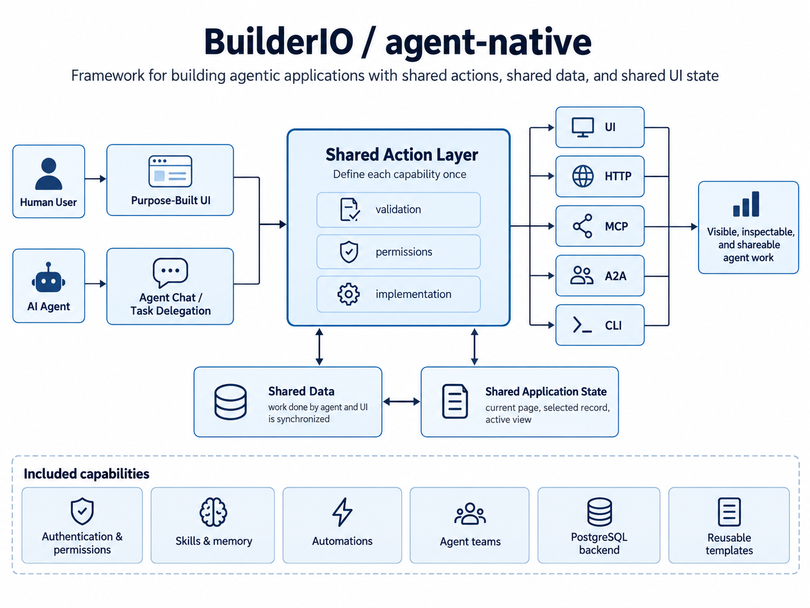
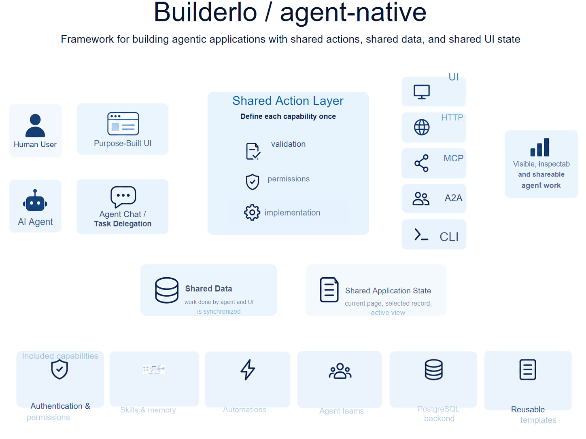
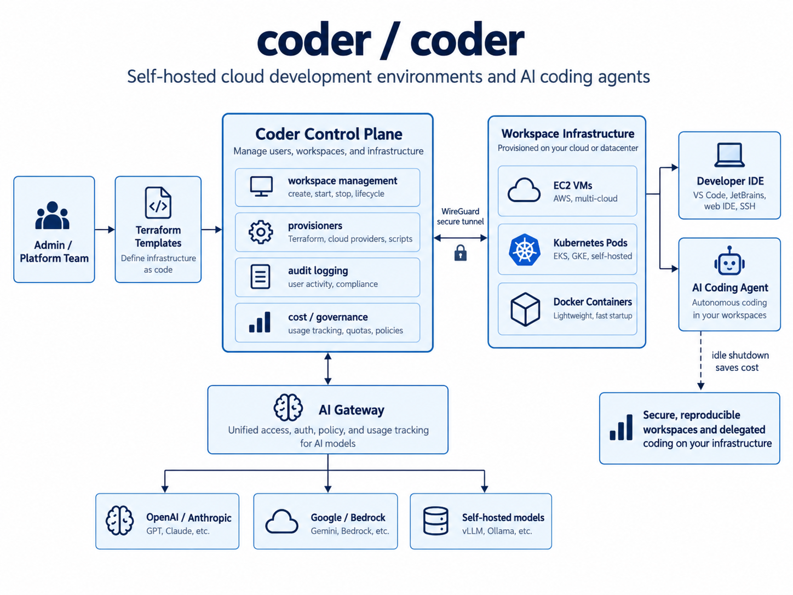
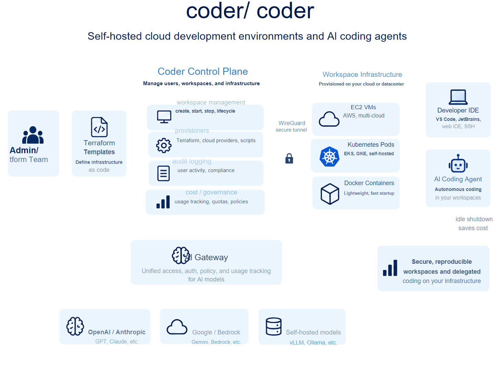
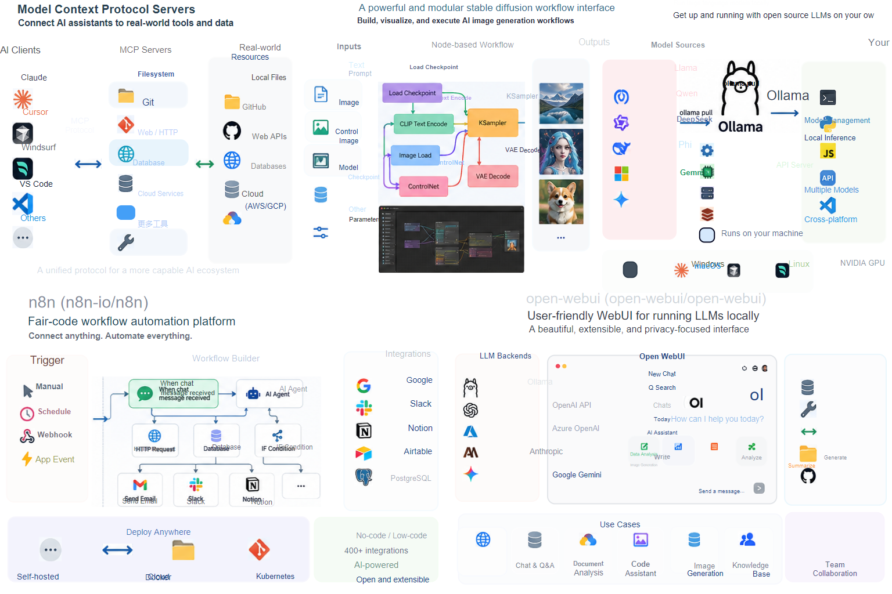
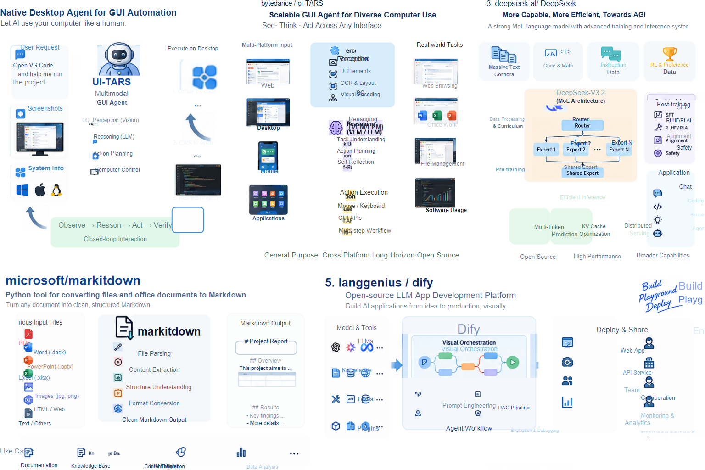
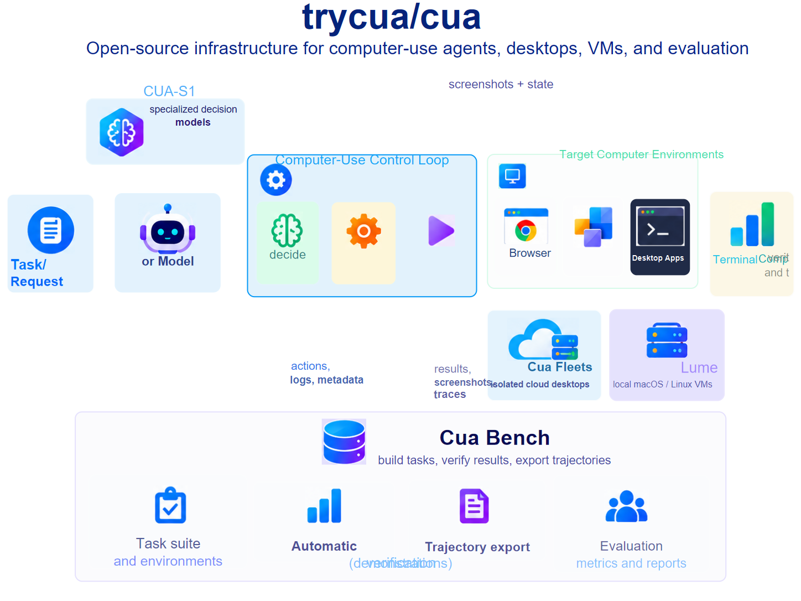
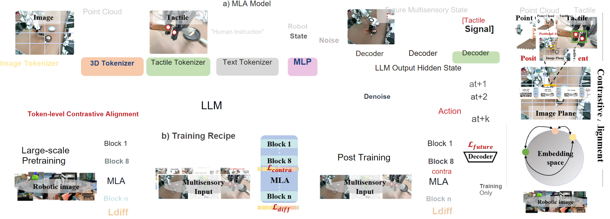

# Diagram2PPT

<p align="center">
  <strong>AI can generate the figure. Diagram2PPT makes it editable.</strong><br>
  Turn PNG, screenshots and AI-generated diagrams into editable PowerPoint & SVG.
</p>

<p align="center">
  
  
  
</p>

<p align="center">
  <strong>PNG / Screenshot / ChatGPT Diagram → Editable PowerPoint + SVG</strong><br>
  <sub>No VLM · No Skill · No per-image prompt engineering</sub>
</p>

---

## AI 已经会画图了，但它没有把“源文件”交给你

现在用 ChatGPT 或其他生成式工具做一张流程图、科研示意图、技术架构图，可能只需要几十秒。

真正麻烦的往往是后面：

- 论文里一个术语要换掉，但文字已经“焊死”在 PNG 里；
- 导师让你把某个模块往左挪一点，只能重新生成或手工重画；
- 标书里的配色、字号、标题需要统一，却拿不到可编辑源文件；
- 组会前发现一个错别字，结果整张图都得重新处理；
- AI 重新生成一次，内容也许改对了，但布局、图标和风格又变了。

**生成一张图越来越快，修改一张图却仍然很慢。**

这就是 Diagram2PPT 想解决的问题。

> **Diagram2PPT 不只是把像素“描成矢量”，而是尝试把一张扁平图片重新拆回可编辑的场景。**

它会组合 OCR、版面分析、开放词汇检测、图像分割和局部矢量化进行结构化重建，**核心流程不依赖 VLM**，并尽可能恢复：

**文字 · 卡片 · 基础图形 · 图标 · 复杂图像块 · 层级 · 坐标关系**

最终可以导出 **SVG、可编辑 PowerPoint、Review HTML 和 QA 对照结果**。

---

## No VLM. No Skill. 先拿到约 80% 的可编辑起点

Diagram2PPT 的一个核心区别是：**它不依赖 ChatGPT、Claude、Gemini 等 VLM 去“看懂图片后重新画一遍”，也不需要为每张图编写专门的 Skill 或反复调 prompt。**

默认路线更接近：

```text
PNG / Screenshot
      ↓
OCR + Layout + Detection + Segmentation
      ↓
Scene Reconstruction
      ↓
Editable PowerPoint / SVG
```

也就是说，输入一张图后，Diagram2PPT 直接尝试恢复其中的**文字、卡片、图形、图标、局部图像和空间关系**，而不是让 VLM 重新生成一个“看起来差不多”的版本。

按照作者目前在典型流程图、科研示意图和 AI 生成架构图上的实际使用经验，**在不调用 VLM、不依赖 Skill 的情况下，首轮自动重建通常已经可以得到约 80% 的可用还原起点**；剩余工作主要集中在字体、间距、少量布局和连接关系等细节上。

> **~80% 是当前典型样例上的经验值，用来描述“离可交付版本还有多少人工工作”，并不是统一数据集上的严格 benchmark。**

这也是 Diagram2PPT 想解决的关键问题：

**不是再调用一个更强的模型重新画图，而是把已经生成好的图，尽可能还原成可以继续编辑的对象。**

---

## 不是“一键无损”，而是把“整张重画”变成“5–10 分钟微调”

目前并没有一种通用方法，能把任意 PNG 真正无损地恢复成原始设计文件。Diagram2PPT 也不假装能做到这一点。

它的目标更实际：

```text
ChatGPT / 截图 / PNG
        ↓
  Diagram2PPT 自动拆解
        ↓
SVG / Editable PowerPoint
        ↓
  人工做最后少量微调
        ↓
论文 / 标书 / 组会 / 汇报成图
```

按照项目作者目前对典型流程图、科研示意图和 AI 生成架构图的实际使用经验，自动转换后通常再手工调整约 **5–10 分钟**，就能得到一个接近原图、同时又能继续编辑的版本。

真正节省的，不只是“转换图片”的时间，而是**不用再从头照着 PNG 重画一遍**。

> **The goal is not perfect automatic reconstruction. The goal is an editable starting point that is already close enough.**

---

## 为什么普通“图片转 SVG”还不够？

很多 raster-to-vector 工具解决的是：**怎样把像素边缘变成 path？**

但科研绘图和 PPT 真正需要的是：**怎样把这段字重新变成文字？这个框重新变成框？这个图标还能单独移动？**

| 方法 | 外观接近原图 | 文字可编辑 | 结构可编辑 | 后续改图 |
|---|---:|---:|---:|---|
| 直接把 PNG 放进 PPT | ✅ | ❌ | ❌ | 很困难 |
| 传统整图矢量化 | 部分 | 通常 ❌ | 很有限 | 困难 |
| OCR + 手工重画 | ✅ | ✅ | ✅ | 代价很高 |
| **Diagram2PPT** | 尽可能保持 | **✅** | **尽可能恢复** | **适合继续微调** |

Diagram2PPT 的思路不是“整图描边”，而是先判断页面由哪些元素组成，再针对不同元素采用不同的恢复方式。

---

## 最适合这些场景

- **科研绘图**：ChatGPT 先生成方法框架图、pipeline、模型结构图，再转成可编辑 SVG / PPTX 做最终统一。
- **标书 / 项目申报**：已有图片或 AI 草图先拆解，再局部调整模块、标题、颜色和图标。
- **组会 / 答辩 / 汇报**：临时改字、移动模块、删除内容，不再因为只有 PNG 而重做整张图。
- **技术架构图 / 产品流程图**：把截图、历史方案图和 AI 生成图转换成可以继续维护的版本。

---

## 效果展示

下面的示例均由项目流水线生成，**没有人工重新描图**。左侧为输入图片，右侧为 SVG 的 QA 渲染结果；PowerPoint 使用同一份 Scene IR 导出。

### 示例 1：AI / 架构图中的文字、卡片与图标

<table>
  <tr>
    <th width="50%">Input</th>
    <th width="50%">Reconstruction</th>
  </tr>
  <tr>
    <td></td>
    <td></td>
  </tr>
</table>

这里最重要的不是“右边看起来像不像一张图片”，而是其中识别出的文字、基础图形和主要页面元素已经重新成为独立对象，可以继续调整。

### 示例 2：复杂技术架构图

<table>
  <tr>
    <th width="50%">Input</th>
    <th width="50%">Reconstruction</th>
  </tr>
  <tr>
    <td></td>
    <td></td>
  </tr>
</table>

复杂界面、图标和不适合强行矢量化的内容会优先保留为局部高质量图像，而不是为了“纯矢量”牺牲视觉效果。

### 更多结果

<table>
  <tr>
    <td></td>
    <td></td>
  </tr>
  <tr>
    <td></td>
    <td></td>
  </tr>
</table>

输入图与重建结果的完整逐组对照见 [SHOWCASE](docs/SHOWCASE.md)。

---

## 到底哪些东西是“可编辑”的？

| 元素 | 当前处理方式 |
|---|---|
| 文字 | 恢复为 SVG `<text>` / PowerPoint 文本框 |
| 矩形、圆角矩形、圆、椭圆 | 尽可能恢复为原生图形 |
| 简单纯色图标 | 使用 VTracer 局部矢量化 |
| logo / icon / robot / document 等对象 | 使用 SAM3 分割并独立保留 |
| 照片、建筑渲染、点云、热力图 | 保留原始局部像素，避免低质量伪矢量化 |
| 页面层级与坐标 | 通过 Scene IR 统一维护 |
| PowerPoint | 文本框、原生形状、图片和路径分对象导出 |

也就是说，**复杂内容不一定全部变成 path，但尽可能不再是“一整张死图”。**

---

## 工作原理

Diagram2PPT 的核心不是“整图描边”，而是先分析页面结构，再重建一个可编辑场景：

```text
Input image
    ↓
Layout / OCR / Detection / Segmentation
    ↓
Editable Scene Reconstruction
    ↓
SVG / PowerPoint / Review / QA
```

内部会根据元素类型选择不同策略：文字恢复为文本对象，规则图形尽量恢复为原生形状，复杂图像区域则优先保真，而不是为了“纯矢量”牺牲视觉质量。

完整 pipeline、Scene IR 与后端设计见 [ARCHITECTURE.md](docs/ARCHITECTURE.md)。

> **Compatibility:** 项目内部 Python 包名仍为 `image2svg`。现有 `image2svg` / `image2svg-gui` 命令继续可用，同时新增 `diagram2ppt` 命令作为新的品牌入口。

## 安装

项目需要 Python 3.10 或更高版本。

```bash
python -m venv .venv
```

Windows：

```powershell
.venv\Scripts\Activate.ps1
pip install -e ".[dev,qa,pptx]"
```

Linux/macOS：

```bash
source .venv/bin/activate
pip install -e ".[dev,qa,pptx]"
```

MinerU、GroundingDINO、PaddleOCR 和 SAM3 的依赖体积较大，建议放在独立 AI 环境中，通过环境变量连接：

```powershell
$env:IMAGE2SVG_AI_PYTHON = "C:\path\to\image2svg-ai\python.exe"
$env:IMAGE2SVG_MODEL_ROOT = "C:\path\to\model-folders"
```

模型权重不包含在仓库中。具体环境和模型配置见 [AI.md](AI.md)。

## 使用

### 最小转换

```bash
image2svg input.png -o output.svg
```

### 推荐参数：常规流程图和科研示意图

这套参数是当前默认推荐组合，适合大多数文字、卡片和局部复杂图像混合的页面：

```powershell
image2svg input.png -o output.svg `
  --pptx output.pptx `
  --html output.review.html `
  --detect `
  --mineru --ocr --ocr-device cpu `
  --ai-background "#FFFFFF" `
  --ai-device cuda `
  --qa
```

也可以使用等价的平衡预设：

```bash
image2svg input.png -o output.svg --pptx output.pptx --preset balanced --qa
```

### 论文与复杂图增强模式

论文截图中常包含照片、点云、触觉图、实验结果和多面板子图。增强模式使用 SAM3 定位这些区域，并优先保留原始裁剪，避免把复杂图形强行生成为低质量矢量：

```bash
image2svg paper.png -o paper.svg \
  --pptx paper.pptx \
  --html paper.review.html \
  --preset paper \
  --qa
```

`paper` 预设等价于启用 GroundingDINO、MinerU、整图 OCR、SAM3 以及 `photo`、`image`、`diagram`、`chart`、`point cloud`、`tactile` 提示词。

### 图标密集页面

如果页面包含大量 logo、机器人、数据库、云服务或应用图标，可以启用 SAM3 图标增强模式：

```powershell
image2svg input.png -o output.svg `
  --pptx output.pptx `
  --html output.review.html `
  --detect --detect-threshold 0.22 `
  --mineru --ocr `
  --sam3 `
  --prompt icon `
  --prompt logo `
  --prompt symbol `
  --prompt robot `
  --prompt document `
  --prompt database `
  --prompt cloud `
  --prompt browser `
  --prompt terminal `
  --prompt "computer monitor" `
  --prompt user `
  --ai-refine vector `
  --ai-fallback image `
  --ai-background "#FFFFFF" `
  --ai-device cuda `
  --qa
```

图标增强模式计算量更大，不建议对所有图片无条件启用。

### 纯矢量模式

严格禁止嵌入位图：

```bash
image2svg input.png -o output.svg --vector-only
```

`--vector-only` 会牺牲照片、复杂渲染图和多色图标的视觉保真度。

### 桌面界面

安装后运行：

```bash
image2svg-gui
```

界面支持批量选择图片、设置输出目录，并在基础、平衡、论文增强三种模式间切换。基础模式仅生成 SVG；平衡和论文增强模式会生成结构化场景，可继续导出 PPTX 与审阅页。AI 模型仍运行在单独的 Python 环境中，可在界面填写该环境的解释器路径和模型根目录，也可以预先设置 `IMAGE2SVG_AI_PYTHON` 与 `IMAGE2SVG_MODEL_ROOT`。

Windows 打包：

```powershell
.\tools\build_gui.ps1 -Python python
```

脚本使用 PyInstaller 生成 `dist/image2svg-gui/`。该目录包含轻量运行时和界面，不包含模型权重；MinerU、GroundingDINO、PaddleOCR 与 SAM3 继续通过外部 AI 环境调用。

如果 Windows 上需要将 Cairo DLL 一并放入发行目录，可设置 `IMAGE2SVG_CAIRO_DIR`，或传入 `-CairoDirectory C:\path\to\cairo\bin`。

## 输出文件

```text
output.svg                 structured SVG
output.pptx                editable PowerPoint
output.review.html         interactive review page
output.qa/render.png       rendered reconstruction
output.qa/comparison.png   pixel difference visualization
output.qa/metrics.json     QA metrics
conversion_report.json     structure and audit report
```

`review.html` 适合快速检查原图、重建结果和元素结构；`metrics.json` 只能作为辅助指标，大片空白也可能获得虚高的像素相似度，因此不能代替视觉检查。

## 文档

如果你想进一步了解实现细节：

- [SHOWCASE.md](docs/SHOWCASE.md) — 更多输入 / 重建效果对照
- [ARCHITECTURE.md](docs/ARCHITECTURE.md) — pipeline、Scene IR 与系统结构
- [TECH_STACK.md](docs/TECH_STACK.md) — 完整技术栈与组件说明
- [AI.md](AI.md) — MinerU、GroundingDINO、PaddleOCR、SAM3 等 AI 环境配置
- [DEVELOPMENT.md](DEVELOPMENT.md) — 开发、测试与工程说明

## 当前限制

Diagram2PPT 目前仍处于实验阶段，主要边界包括：

- 当前不重建箭头和连接关系。
- 字体家族、字距、渐变、阴影和复杂排版无法完全还原。
- 文字密集或图标密集页面可能需要进一步微调。
- 照片、3D 渲染、点云和复杂纹理会优先保留为局部图片，而不会伪装成低质量纯矢量。
- 像素相似度不等于结构恢复正确，也不等于真正可编辑。

## Roadmap

接下来希望逐步补齐：

- 箭头与连接关系恢复；
- 更稳定的字体、字号与文本布局重建；
- 更好的复杂图标 / 图形原生化；
- 更强的论文多面板理解；
- 更顺滑的 **AI 生成 → 自动拆解 → 人工微调 → 最终交付** 工作流。

如果你也经常遇到：

> “这张图明明已经很好了，我只是想改几个字，为什么最后还是要重画？”

那这就是 Diagram2PPT 想解决的问题。

## License

Diagram2PPT 的源代码采用 [Apache License 2.0](LICENSE) 发布。

第三方依赖、AI 模型、模型权重、数据集和示例素材仍受其各自许可证与使用条款约束，不包含在 Diagram2PPT 的 Apache-2.0 授权范围内。发布或商用前，请分别核对相关组件与模型的当前许可要求。
