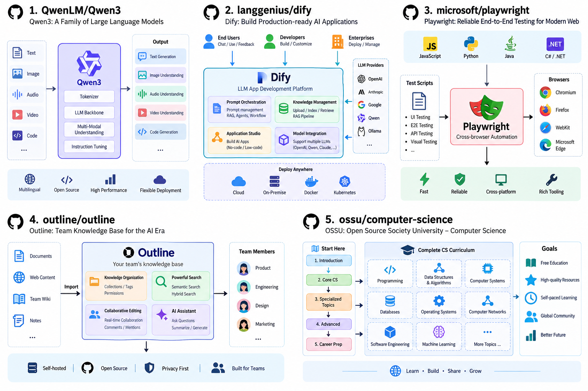
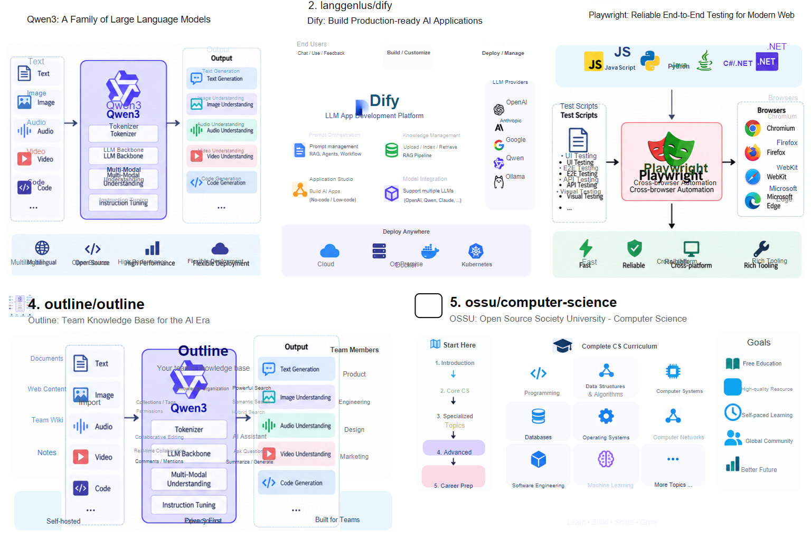

# image2svg

将 PNG、JPG、WebP 或截图重建为结构化、可继续编辑的 SVG 和 PowerPoint。

image2svg 面向流程图、科研示意图、信息图和 PPT 风格图片。它不会简单地把整张原图贴进幻灯片，而是组合 OCR、版面分析、开放词汇检测、图像分割和局部矢量化，尽可能恢复文字、基础图形、复杂图像块、层级与坐标关系。

> 当前状态：实验性开发版本。复杂视觉对象优先保留清晰的原图裁剪，简单纯色对象优先重建为原生图形或矢量路径。当前不重建箭头和连接关系。

## 效果展示

以下图片均由项目流水线生成，未经过人工重绘。左侧为输入图片，右侧为 SVG 的 QA 渲染结果；PowerPoint 使用同一份 Scene IR 导出。

### 架构图：文字、卡片与图标

<table>
  <tr>
    <th width="50%">输入图片</th>
    <th width="50%">重建结果</th>
  </tr>
  <tr>
    <td></td>
    <td></td>
  </tr>
</table>

文字、卡片和小图标被拆分为独立元素；截图中的连接线不会重建。

### 多项目技术架构图

<table>
  <tr>
    <th width="50%">输入图片</th>
    <th width="50%">重建结果</th>
  </tr>
  <tr>
    <td></td>
    <td></td>
  </tr>
</table>

多项目页面中的标题、卡片、图标和局部截图被拆分处理；复杂界面与品牌图形保留为局部高质量图像。

### 更多输入集

下列样例选自 `input_chatgpt`、`input3`、`input4` 和论文截图目录 `arti`。这里展示的是最终 SVG 的 QA 渲染结果。

<table>
  <tr>
    <td></td>
    <td></td>
  </tr>
  <tr>
    <td></td>
    <td></td>
  </tr>
  <tr>
    <td></td>
    <td></td>
  </tr>
</table>

输入图与重建结果的逐组对照见 [完整效果集](docs/SHOWCASE.md)。

## 当前能力

- 将识别到的文字恢复为 SVG `<text>` 和 PowerPoint 文本框。
- 根据原始坐标、文字框尺寸和相邻图形估计字号、对齐方式与避让位置。
- 将矩形、圆角矩形、圆和椭圆恢复为原生图形。
- 对简单纯色图标使用 VTracer 进行局部矢量化。
- 使用 SAM3 分割 icon、logo、robot、document 等复杂对象。
- 对照片、建筑渲染、热力图和复杂多色图标保留原始像素，避免低质量重新生成。
- 使用 Scene IR 合并多种分析结果，并执行去重、层级排序、文字清理和坐标校正。
- 导出 SVG、可编辑 PPTX、交互式 HTML 审查页和 QA 渲染结果。
- MinerU、GroundingDINO、PaddleOCR 和 SAM3 等重型 AI 后端通过本地子进程桥接。

## 工作原理

```text
Input image
    |
    +-- GroundingDINO  -> panels, cards, containers and detected icons
    +-- MinerU         -> page layout, text blocks and image regions
    +-- PaddleOCR      -> editable text and source coordinates
    +-- SAM3           -> logos, icons and complex visual objects
    +-- VTracer        -> local vector paths for flat graphics
    |
    v
Scene IR
    |
    +-- deduplication / z-order / text fitting / cleanup
    |
    +-- SVG
    +-- editable PPTX
    +-- review HTML
    +-- QA render and metrics
```

核心中间表示为 `Scene(width, height, background, elements)`。同一份 Scene IR 同时驱动 SVG、PowerPoint 和审查页面，避免不同导出格式各自维护一套布局逻辑。

## 安装

项目需要 Python 3.10 或更高版本。

```bash
python -m venv .venv
```

Windows：

```powershell
.venv\Scripts\Activate.ps1
pip install -e ".[dev,qa,pptx]"
```

Linux/macOS：

```bash
source .venv/bin/activate
pip install -e ".[dev,qa,pptx]"
```

MinerU、GroundingDINO、PaddleOCR 和 SAM3 的依赖体积较大，建议放在独立 AI 环境中，通过环境变量连接：

```powershell
$env:IMAGE2SVG_AI_PYTHON = "C:\path\to\image2svg-ai\python.exe"
$env:IMAGE2SVG_MODEL_ROOT = "C:\path\to\model-folders"
```

模型权重不包含在仓库中。具体环境和模型配置见 [AI.md](AI.md)。

## 使用

### 最小转换

```bash
image2svg input.png -o output.svg
```

### 推荐参数：常规流程图和科研示意图

这套参数是当前默认推荐组合，适合大多数文字、卡片和局部复杂图像混合的页面：

```powershell
image2svg input.png -o output.svg `
  --pptx output.pptx `
  --html output.review.html `
  --detect `
  --mineru --ocr --ocr-device cpu `
  --ai-background "#FFFFFF" `
  --ai-device cuda `
  --qa
```

也可以使用等价的平衡预设：

```bash
image2svg input.png -o output.svg --pptx output.pptx --preset balanced --qa
```

### 论文与复杂图增强模式

论文截图中常包含照片、点云、触觉图、实验结果和多面板子图。增强模式使用 SAM3 定位这些区域，并优先保留原始裁剪，避免把复杂图形强行生成为低质量矢量：

```bash
image2svg paper.png -o paper.svg \
  --pptx paper.pptx \
  --html paper.review.html \
  --preset paper \
  --qa
```

`paper` 预设等价于启用 GroundingDINO、MinerU、整图 OCR、SAM3 以及 `photo`、`image`、`diagram`、`chart`、`point cloud`、`tactile` 提示词。

### 图标密集页面

如果页面包含大量 logo、机器人、数据库、云服务或应用图标，可以启用 SAM3 图标增强模式：

```powershell
image2svg input.png -o output.svg `
  --pptx output.pptx `
  --html output.review.html `
  --detect --detect-threshold 0.22 `
  --mineru --ocr `
  --sam3 `
  --prompt icon `
  --prompt logo `
  --prompt symbol `
  --prompt robot `
  --prompt document `
  --prompt database `
  --prompt cloud `
  --prompt browser `
  --prompt terminal `
  --prompt "computer monitor" `
  --prompt user `
  --ai-refine vector `
  --ai-fallback image `
  --ai-background "#FFFFFF" `
  --ai-device cuda `
  --qa
```

图标增强模式计算量更大，不建议对所有图片无条件启用。

### 纯矢量模式

严格禁止嵌入位图：

```bash
image2svg input.png -o output.svg --vector-only
```

`--vector-only` 会牺牲照片、复杂渲染图和多色图标的视觉保真度。

### 桌面界面

安装后运行：

```bash
image2svg-gui
```

界面支持批量选择图片、设置输出目录，并在基础、平衡、论文增强三种模式间切换。基础模式仅生成 SVG；平衡和论文增强模式会生成结构化场景，可继续导出 PPTX 与审阅页。AI 模型仍运行在单独的 Python 环境中，可在界面填写该环境的解释器路径和模型根目录，也可以预先设置 `IMAGE2SVG_AI_PYTHON` 与 `IMAGE2SVG_MODEL_ROOT`。

Windows 打包：

```powershell
.\tools\build_gui.ps1 -Python python
```

脚本使用 PyInstaller 生成 `dist/image2svg-gui/`。该目录包含轻量运行时和界面，不包含模型权重；MinerU、GroundingDINO、PaddleOCR 与 SAM3 继续通过外部 AI 环境调用。

如果 Windows 上需要将 Cairo DLL 一并放入发行目录，可设置 `IMAGE2SVG_CAIRO_DIR`，或传入 `-CairoDirectory C:\path\to\cairo\bin`。

## 输出文件

```text
output.svg                 structured SVG
output.pptx                editable PowerPoint
output.review.html         interactive review page
output.qa/render.png       rendered reconstruction
output.qa/comparison.png   pixel difference visualization
output.qa/metrics.json     QA metrics
conversion_report.json     structure and audit report
```

`review.html` 适合快速检查原图、重建结果和元素结构；`metrics.json` 只能作为辅助指标，大片空白也可能获得虚高的像素相似度，因此不能代替视觉检查。

## 技术栈

| 层级 | 技术 | 用途 |
|---|---|---|
| 核心运行时 | Python 3.10+ | CLI、Scene IR、后端编排 |
| 图像处理 | Pillow | 裁剪、透明通道、颜色和图像读写 |
| 传统矢量化 | VTracer | 简单平面图形的局部 SVG 路径 |
| 结构检测 | GroundingDINO / Transformers | 面板、卡片、容器和开放词汇对象检测 |
| 版面分析 | MinerU | 文本块、图片块和页面布局 |
| 文字识别 | PaddleOCR / PP-OCRv6 | 可编辑文字、坐标、颜色和字号估计 |
| 图像分割 | SAM3 | icon、logo、机器人、文档等对象分割 |
| AI 运行时 | PyTorch、NumPy、OpenCV | 模型推理、几何拟合和遮罩处理 |
| SVG 渲染 | CairoSVG | QA 渲染和非原生矢量回退 |
| PowerPoint | python-pptx | 原生形状、文本框、图片和路径导出 |
| 桌面界面 | Tkinter | 批量选择、预设切换和运行日志 |
| Windows 打包 | PyInstaller | 生成可分发的 GUI 目录 |
| 测试与检查 | pytest、Ruff | 回归测试和静态检查 |

更详细的实现说明见 [ARCHITECTURE.md](docs/ARCHITECTURE.md) 和 [TECH_STACK.md](docs/TECH_STACK.md)。

## 项目结构

```text
src/image2svg/
  analyze/       wrappers around external AI processes
  ai/scripts/    scripts executed inside the heavy AI environment
  backends/      reconstruction backends
  core/          Scene IR and shared result models
  reconstruct/   element recovery, tracing, cleanup and text layout
  svg/           SVG build, render and audit
  export/        PPTX and HTML exporters
  qa/            visual comparison
  report/        conversion reports
docs/
  assets/        README and release images
tests/           unit and integration tests
examples/input/  local test inputs
examples/output/ generated artifacts, ignored by Git
```

## 测试

```bash
pytest -q
ruff check src tests
```

CI 只验证轻量核心环境，不下载模型权重或运行 GPU 推理。

## 已知限制

- 当前不重建箭头和连接关系。
- 字体家族、字距、渐变、阴影和复杂排版无法完全还原。
- 全图 OCR 适合文字密集页面，但可能产生重复文本或局部拥挤。
- 图标密集页面通常需要 SAM3 和更具体的 prompt。
- 当前大面积复杂图块存在面积阈值，极大的视觉区域可能需要额外保真回退。
- 照片、3D 渲染和复杂纹理不会被强制转换成低质量矢量图，而会保留为局部图片。
- 像素相似度不能代表可编辑程度，也不能单独作为质量结论。

## 发布前检查

- 选择并添加合适的 `LICENSE`；仓库当前没有替使用者决定开源许可证。
- 确认示例图片拥有公开展示和再分发权限。
- 不要提交模型权重、私有数据、API Key、绝对路径或本地环境文件。
- 发布或商用前应分别核对 MinerU、GroundingDINO、PaddleOCR、SAM3 和相关模型权重的许可证。
- 大型 PPTX 或演示文件建议通过 Git LFS 或 GitHub Release 提供。

## 项目定位

image2svg 目前更适合作为“半自动、可审查、可继续编辑”的重建工具，而不是面向任意图片的一键无损转换器。项目优先保证结构透明和后续可编辑性，并保留 review 与 QA 产物帮助定位失败案例。
