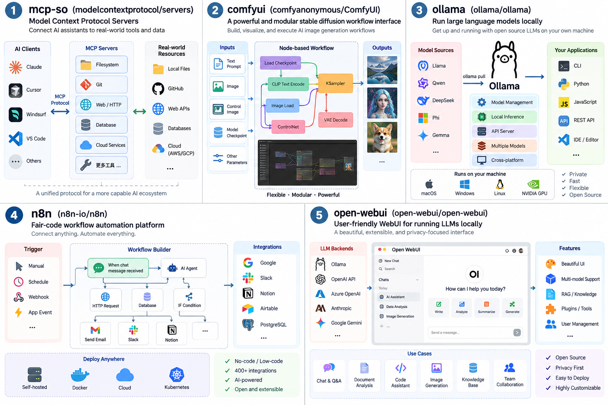
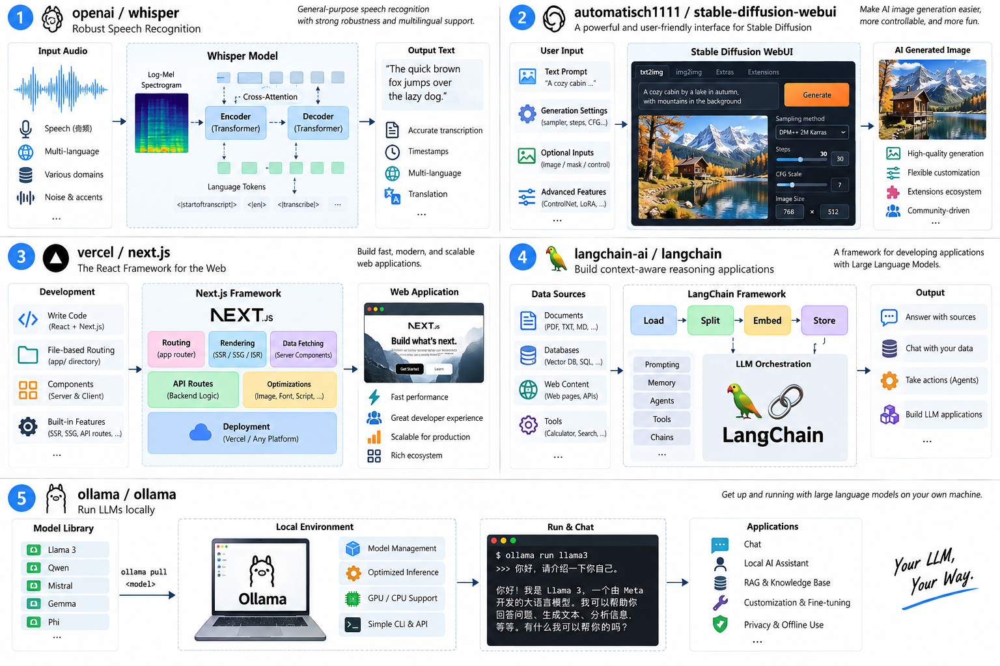
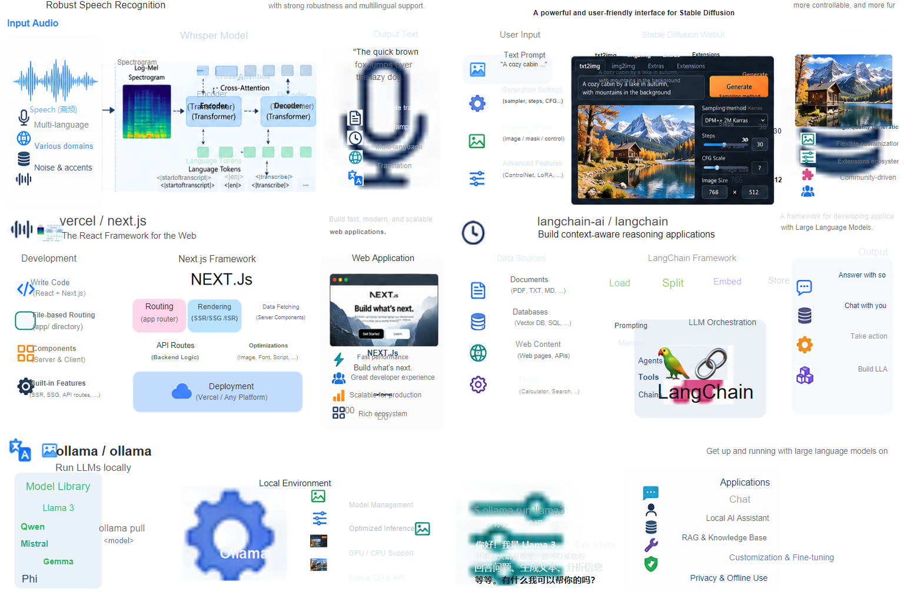
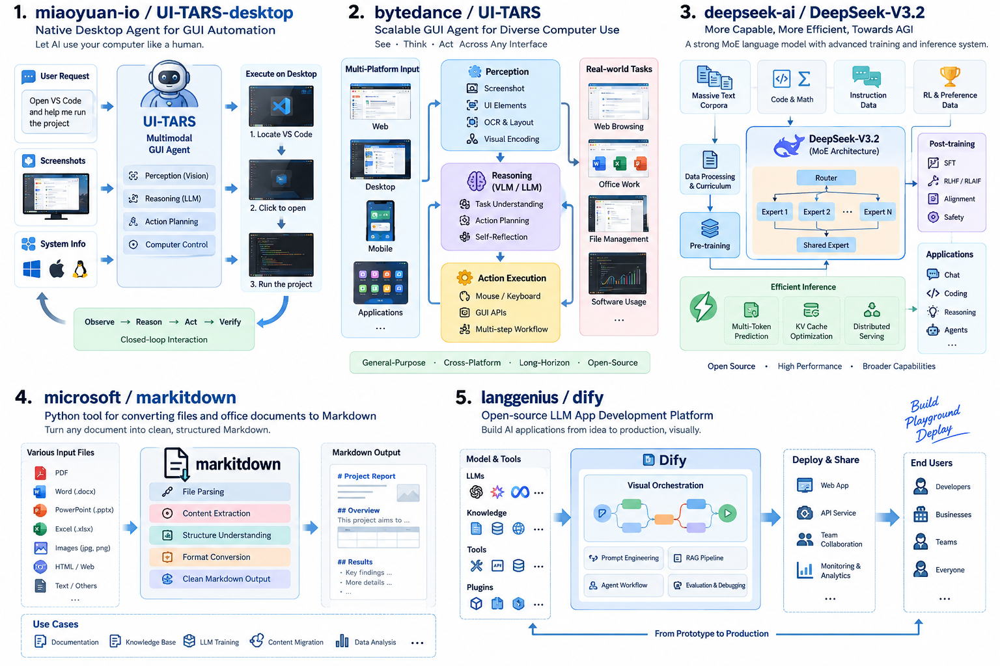
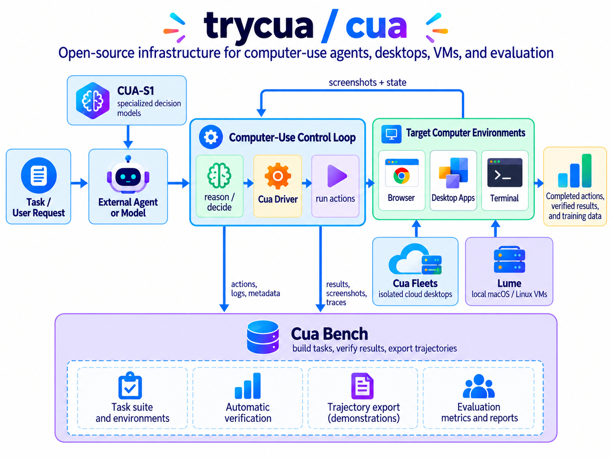
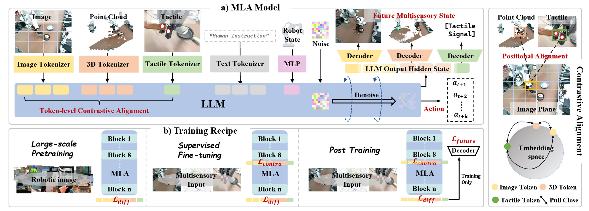

# 效果集

这些图片由同一份 Scene IR 导出。左侧是输入截图，右侧是 SVG 的 QA 渲染结果。样例只用于展示当前能力边界，像素相似度不作为唯一质量标准。

## input_chatgpt：图标与卡片

<table>
  <tr><th width="50%">输入</th><th width="50%">重建</th></tr>
  <tr>
    <td></td>
    <td></td>
  </tr>
  <tr>
    <td></td>
    <td></td>
  </tr>
</table>

## input3：多项目与工具生态图

<table>
  <tr><th width="50%">输入</th><th width="50%">重建</th></tr>
  <tr>
    <td></td>
    <td></td>
  </tr>
  <tr>
    <td></td>
    <td></td>
  </tr>
  <tr>
    <td></td>
    <td></td>
  </tr>
  <tr>
    <td></td>
    <td></td>
  </tr>
</table>

## input4：图标密集架构图

<table>
  <tr><th width="50%">输入</th><th width="50%">重建</th></tr>
  <tr>
    <td></td>
    <td></td>
  </tr>
</table>

## arti：论文复杂子图

该样例使用 `--preset paper`。文字和规则容器保持可编辑，照片、触觉图和其他复杂科研子图保留为局部原图。

<table>
  <tr><th width="50%">输入</th><th width="50%">重建</th></tr>
  <tr>
    <td></td>
    <td></td>
  </tr>
</table>

## 当前边界

- 当前不重建箭头，因此输入中的连接线不会出现在结果中。
- 密集文字可能需要在 PowerPoint 中微调字号或换行。
- 照片、点云和复杂纹理以局部位图保真，不会伪装成纯矢量。
- 公开发布前需要确认所有输入图片的展示与再分发权限。
